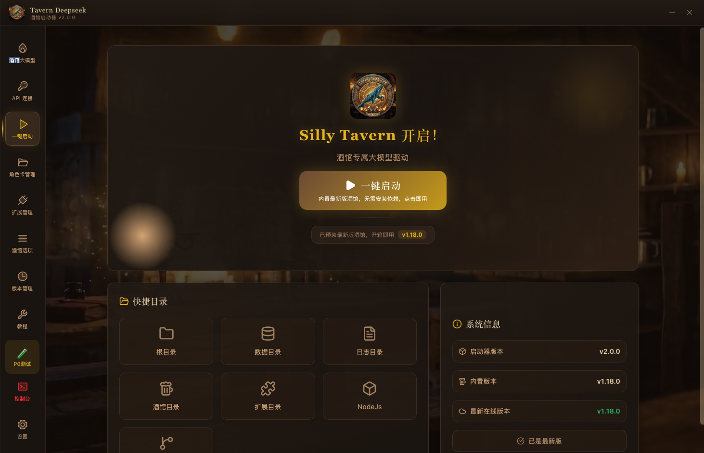
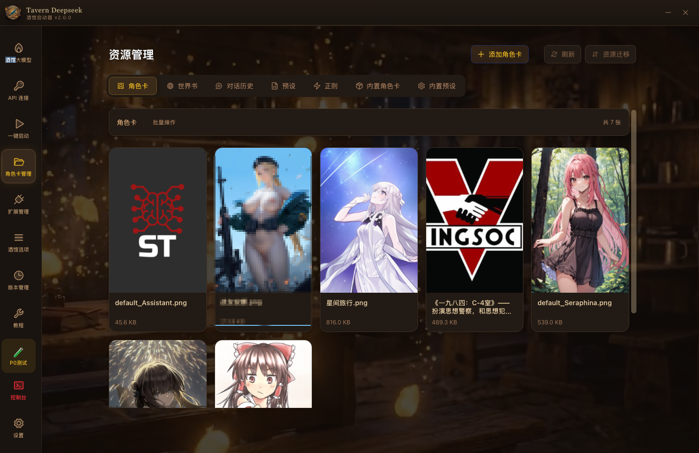
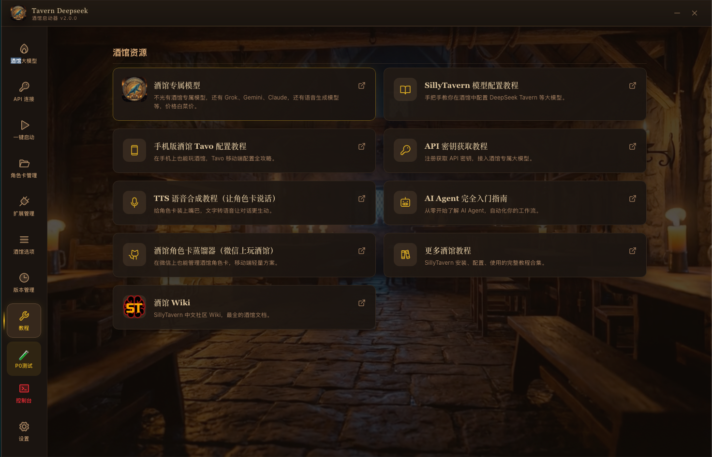

<div align="center">


# 🍺 Tavern Deepseek Launcher

**SillyTavern 酒馆桌面启动器 — 零配置、一键启动**

[](https://github.com/leigegehaha/sillytavernlauncher/releases)
[](https://github.com/leigegehaha/sillytavernlauncher/releases)
[](https://v2.tauri.app/)
[](https://vuejs.org/)
[](LICENSE)

<p>
  <sub>中世纪酒馆暗黑奇幻风 · 内置 DeepSeek Tavern 大模型 · 内置 DeepTavern 聊天 · 105 角色卡即插即用</sub>
</p>

</div>

---

<div align="center">

## 📸 界面预览



<details>
<summary><b>📷 更多截图 — 点击展开</b></summary>
<br>
<p><b>🃏 角色卡管理</b></p>

<br><br>
<p><b>📖 配置教程</b></p>

</details>

---

## 🎬 演示视频

<video src="assets/media/demo视频.mp4" controls width="85%"></video>

</div>

---

## 🍺 酒馆大模型 — DeepSeek Tavern

> 启动器内置**酒馆专属大模型服务**，为 SillyTavern 角色扮演深度定制

<table>
<tr>
  <td width="50%">
    <h3>🧠 v2-pro</h3>
    旗舰模型，极致角色扮演体验<br>
    擅长复杂剧情推理与长对话
  </td>
  <td width="50%">
    <h3>⚡ v2-turbo</h3>
    快速响应，适合日常对话<br>
    低延迟，高性价比
  </td>
</tr>
<tr>
  <td>
    <h3>🎭 角色扮演优化</h3>
    专为 SillyTavern 调优<br>
    中文角色扮演自然流畅
  </td>
  <td>
    <h3>💰 按量计费</h3>
    按 token 计费，低门槛<br>
    用多少付多少
  </td>
</tr>
</table>

### 🔑 三步开始

| 步骤 | 操作 |
|:---:|---|
| **①** | 点击启动器左侧 **🍺 酒馆大模型** |
| **②** | 点击 **"酒馆专属大模型网站"** → [deepseektavern.com](https://deepseektavern.com) 注册获取 Key |
| **③** | 粘贴 Key 到 **API 连接** 页面 → 🍺 完成！ |

---

## ✨ 功能一览

<table>
<tr>
  <td align="center" width="25%">
    <h3>🍺<br>酒馆大模型</h3>
    DeepSeek Tavern 模型服务<br>API Key 一键管理
  </td>
  <td align="center" width="25%">
    <h3>🗣️<br>DeepTavern</h3>
    内置沉浸式聊天客户端<br>中世纪酒馆 UI · 流式对话
  </td>
  <td align="center" width="25%">
    <h3>🔑<br>API 连接</h3>
    多 Provider 密钥管理<br>OpenAI 兼容端点
  </td>
  <td align="center" width="25%">
    <h3>▶️<br>一键启动</h3>
    SillyTavern 零配置<br>内置 Node.js 自动部署
  </td>
</tr>
<tr>
  <td align="center">
    <h3>🃏<br>角色卡管理</h3>
    PNG 解析/导入/删除<br>105 张内置角色卡
  </td>
  <td align="center">
    <h3>🔌<br>拓展管理</h3>
    Git 安装/更新/启停<br>插件生态一键管理
  </td>
  <td align="center">
    <h3>⚙️<br>酒馆选项</h3>
    config.yaml 可视化编辑<br>配置迁移一键完成
  </td>
  <td align="center">
    <h3>📦<br>版本管理</h3>
    SillyTavern 多版本<br>安装/切换/卸载
  </td>
</tr>
</table>

---

## 🏗️ 技术栈

<div align="center">

| 层 | 技术 | 说明 |
|:---:|------|------|
| 🖥️ **桌面** | [Tauri v2](https://v2.tauri.app/) | Rust 驱动，原生性能，体积 < 5MB |
| 🎨 **前端** | Vue 3 + Vite + Tailwind CSS | 响应式 + 中世纪酒馆手工暗黑主题 |
| ⚙️ **后端** | Rust · tokio · reqwest · serde | 异步 I/O，类型安全 |
| 📦 **打包** | Tauri Bundler + GitHub Actions | macOS DMG · Windows NSIS · Linux AppImage/deb/rpm |

</div>

---

## 📦 下载安装

> 🚀 **国内用户下载加速**：点击下方 🇨🇳 加速链接，通过 `ghfast.top` 代理高速下载。

### 🍎 macOS（Intel / Apple Silicon）

| 版本 | 文件 | GitHub | 🇨🇳 ghfast.top 加速 |
|------|------|--------|---------------------|
| Apple Silicon (M1-M4) | `.dmg` | [下载](https://github.com/leigegehaha/sillytavernlauncher/releases/download/v2.0.1/Tavern.Deepseek_2.0.1_aarch64.dmg) | [🚀 国内加速](https://ghfast.top/https://github.com/leigegehaha/sillytavernlauncher/releases/download/v2.0.1/Tavern.Deepseek_2.0.1_aarch64.dmg) |
| Intel x64 | `.dmg` | [下载](https://github.com/leigegehaha/sillytavernlauncher/releases/download/v2.0.1/Tavern.Deepseek_2.0.1_x64.dmg) | [🚀 国内加速](https://ghfast.top/https://github.com/leigegehaha/sillytavernlauncher/releases/download/v2.0.1/Tavern.Deepseek_2.0.1_x64.dmg) |

1. 下载对应架构 `.dmg` → 双击挂载 → 拖入 `Applications`
2. 首次打开如果提示 **"已损坏，无法打开"**，运行以下命令即可：

```bash
sudo xattr -rd com.apple.quarantine "/Applications/Tavern Deepseek.app"
```

> 💡 **为什么？** App 未签 Apple 开发者证书，macOS Gatekeeper 会自动隔离网上下载的应用。

### 🪟 Windows

| 文件 | GitHub | 🇨🇳 ghfast.top 加速 |
|------|--------|---------------------|
| `x64-setup.exe` (132MB) | [下载](https://github.com/leigegehaha/sillytavernlauncher/releases/download/v2.0.1/Tavern.Deepseek_2.0.1_x64-setup.exe) | [🚀 国内加速](https://ghfast.top/https://github.com/leigegehaha/sillytavernlauncher/releases/download/v2.0.1/Tavern.Deepseek_2.0.1_x64-setup.exe) |

下载安装包 → 双击安装 → 开始使用

### 🐧 Linux

| 格式 | 文件 | GitHub | 🇨🇳 ghfast.top 加速 |
|------|------|--------|---------------------|
| `.deb` (Debian/Ubuntu) | `amd64.deb` (187MB) | [下载](https://github.com/leigegehaha/sillytavernlauncher/releases/download/v2.0.1/Tavern.Deepseek_2.0.1_amd64.deb) | [🚀 国内加速](https://ghfast.top/https://github.com/leigegehaha/sillytavernlauncher/releases/download/v2.0.1/Tavern.Deepseek_2.0.1_amd64.deb) |
| `.AppImage` (免安装) | `amd64.AppImage` (245MB) | [下载](https://github.com/leigegehaha/sillytavernlauncher/releases/download/v2.0.1/Tavern.Deepseek_2.0.1_amd64.AppImage) | [🚀 国内加速](https://ghfast.top/https://github.com/leigegehaha/sillytavernlauncher/releases/download/v2.0.1/Tavern.Deepseek_2.0.1_amd64.AppImage) |

> 🔁 备用代理：`https://ghproxy.cc/` `https://gh.llkk.cc/`（把 GitHub 链接前缀替换即可）

---

## 🛠️ 从源码构建

```bash
# 克隆仓库
git clone https://github.com/leigegehaha/sillytavernlauncher.git
cd sillytavernlauncher

# 安装依赖 (推荐 bun)
bun install

# 开发模式
bun run tauri dev

# 生产构建
bun run tauri build
```

> 需要 [Rust](https://rustup.rs/) (latest stable) + [Bun](https://bun.sh/) 或 Node.js 18+

---

## 📂 项目结构

<details>
<summary><b>点击展开目录树 📁</b></summary>

```
sillytavern-launcher/
├── src/                        # Vue 3 前端
│   ├── views/
│   │   ├── DeepSeek.vue        # 🍺 酒馆大模型
│   │   ├── ApiConfig.vue       # 🔑 API 连接
│   │   ├── Home.vue            # ▶️ 一键启动
│   │   ├── Resources.vue       # 🃏 角色卡管理
│   │   ├── Extensions.vue      # 🔌 拓展管理
│   │   ├── Tavern.vue          # ⚙️ 酒馆选项
│   │   ├── Versions.vue        # 📦 版本管理
│   │   ├── Console.vue         # 🖥️ 控制台
│   │   ├── Tools.vue           # 🛠️ 教程
│   │   └── Settings.vue        # 设置
│   ├── deep-tavern/            # 🗣️ DeepTavern 内置聊天
│   │   ├── DeepTavernView.vue  # 全屏聊天主视图
│   │   ├── components/         # 酒馆主题组件
│   │   ├── stores/             # reactive 状态管理
│   │   ├── composables/        # useStreamChat, useParticles
│   │   ├── styles/             # tavern-theme.css
│   │   └── types/              # TS 类型定义
│   ├── components/
│   │   ├── TavernAccount.vue   # 酒馆大模型账户
│   │   └── BackgroundVideo.vue # 动态背景
│   └── layouts/Oheader.vue     # 中世纪酒馆侧边栏
├── src-tauri/                  # Rust 后端
│   ├── src/
│   │   ├── lib.rs              # 应用入口
│   │   ├── sillytavern.rs      # SillyTavern 管理
│   │   ├── deep_tavern/        # DeepTavern 后端
│   │   │   ├── api_config.rs   # API 配置管理
│   │   │   ├── character_reader.rs # 角色卡读取
│   │   │   ├── chat_engine.rs  # 流式聊天引擎
│   │   │   └── chat_storage.rs # 聊天记录存储
│   │   ├── secrets.rs          # API 密钥管理
│   │   ├── tavern_api.rs       # 酒馆 API 客户端
│   │   ├── config.rs           # 配置管理
│   │   └── character.rs        # 角色卡处理
│   └── tauri.conf.json
├── assets/
│   ├── logo.png
│   └── media/                  # 截图 & 演示视频
└── .github/workflows/          # CI/CD 自动构建
```

</details>

---

## 🎨 设计风格

<div align="center">

```
╔══════════════════════════════════════╗
║   中世纪酒馆 · 羊皮卷轴 · 暗黑奇幻  ║
╠══════════════════════════════════════╣
║  底色  #120c08    金辉  #e6b422     ║
║  边框  #b48c64    文字  #d4a574     ║
║  玻璃拟态侧边栏   动态火焰背景      ║
╚══════════════════════════════════════╝
```

</div>

---

## 🧪 路线图

- [x] macOS 原生支持
- [x] DeepSeek Tavern 酒馆大模型集成
- [x] 角色卡管理 + 105 内置角色卡
- [x] GitHub Actions 跨平台自动构建
- [x] **DeepTavern** — 内置沉浸式聊天客户端（中世纪酒馆 UI）
- [x] 内置 SillyTavern + Node.js（零配置启动）
- [x] 内置角色卡 + 预设（开箱即用）
- [ ] TTS 语音合成集成
- [ ] 更多模型 Provider 支持

---

## ❓ 常见问题

<details>
<summary><b>🍎 macOS 打开提示"已损坏"/"无法验证开发者"</b></summary>

**原因**：App 未签 Apple 开发者证书，macOS Gatekeeper 会自动隔离网上下载的应用。

**解决**：在终端运行以下命令移除隔离标记：

```bash
sudo xattr -rd com.apple.quarantine "/Applications/Tavern Deepseek.app"
```

之后就能正常打开了。这是**一次性的**，不需要每次更新都重复。
</details>

<details>
<summary><b>🔌 启动后提示"未找到内置酒馆"</b></summary>

v2.0.1 起已内置 SillyTavern + Node.js，正常启动即可。如果仍提示未找到：

1. 确认下载的是 **v2.0.1+** 版本（安装包大小 > 130MB）
2. 检查网络连接（首次启动需联网安装依赖 `npm install`）
3. 在 **版本管理** 页面查看 SillyTavern 状态
4. 查看控制台日志排查具体错误
</details>

<details>
<summary><b>🪟 Windows 安装时 SmartScreen 阻止</b></summary>

点击 **"更多信息"** → **"仍要运行"** 即可。原因同上 — App 未签代码证书。
</details>

---

<div align="center">

## 📄 致谢 & 许可

基于 [al01cn/sillyTavern-launcher](https://github.com/al01cn/sillyTavern-launcher) 开发

由 **磊哥哥** ❤️ 维护 · 「磊哥哥科技拆解室」 · MIT License

<br>

*"来酒馆坐坐，喝一杯，聊聊天。"* 🍻

<br>


</div>
