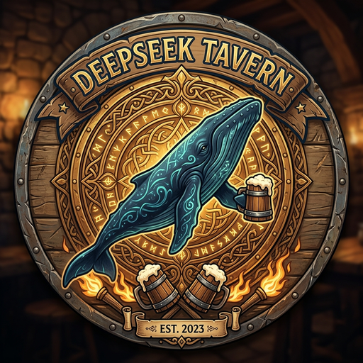

# 🍺 Tavern Deepseek Launcher

> 酒馆启动器 — 专为 SillyTavern 设计的跨平台桌面客户端  
> 中世纪酒馆暗黑奇幻风 · Tauri v2 + Vue 3 · 内置酒馆 & Node.js

<p align="center">
  
</p>

---

## ✨ 特性

| 模块 | 功能 |
|------|------|
| 🍺 **酒馆大模型** | DeepSeek Tavern 专属模型服务，API Key 管理，一键获取 |
| 🔑 **API 连接** | 多 Provider 密钥管理，OpenAI 兼容端点，连接测试 |
| ▶️ **一键启动** | SillyTavern 零配置启动，内置 Node.js 自动部署 |
| 🃏 **角色卡管理** | PNG 角色卡读取/导入/删除，预设角色卡库 |
| 🔌 **拓展管理** | SillyTavern 拓展安装、启停、自动更新 |
| ⚙️ **酒馆选项** | config.yaml 可视化编辑，配置迁移 |
| 📦 **版本管理** | SillyTavern 多版本安装/切换/卸载 |
| 🖥️ **控制台** | 内置酒馆桌面窗口模式，剪贴板管理 |
| 🛠️ **教程 & 工具** | 配置修复、依赖检测、网络诊断 |

## 🏗️ 技术栈

- **桌面框架**: [Tauri v2](https://v2.tauri.app/) (Rust + WebView)
- **前端**: Vue 3 + TypeScript + Vite
- **样式**: Tailwind CSS + 中世纪酒馆手工暗黑主题
- **图标**: Phosphor Icons
- **Rust 后端**: tokio, reqwest, serde, tracing

## 📦 构建

### 前置要求

- [Rust](https://www.rust-lang.org/) (latest stable)
- [Node.js](https://nodejs.org/) 18+
- macOS / Windows / Linux

### 开发

```bash
# 安装前端依赖
npm install

# 启动开发服务器（前端热更新）
npm run dev

# Tauri 开发模式（前端 + Rust 后端）
npm run tauri dev
```

### 生产构建

```bash
npm run tauri build
```

构建产物位于 `src-tauri/target/release/bundle/`。

## 📂 项目结构

```
sillyTavern-launcher/
├── src/                    # Vue 3 前端源码
│   ├── views/              # 页面组件
│   │   ├── DeepSeek.vue    # 酒馆大模型
│   │   ├── ApiConfig.vue   # API 连接
│   │   ├── Home.vue        # 一键启动
│   │   └── ...
│   ├── components/         # 通用组件
│   │   └── TavernAccount.vue
│   ├── layouts/            # 布局
│   │   └── Oheader.vue     # 中世纪酒馆侧边栏
│   ├── lib/                # 工具库
│   └── router/             # 路由
├── src-tauri/              # Rust 后端
│   ├── src/
│   │   ├── lib.rs          # 应用入口 & 命令注册
│   │   ├── sillytavern.rs  # SillyTavern 管理
│   │   ├── secrets.rs      # API 密钥管理
│   │   ├── tavern_api.rs   # 酒馆 API 客户端
│   │   ├── config.rs       # 配置管理
│   │   └── ...
│   └── tauri.conf.json
└── package.json
```

## 🎨 界面预览

中世纪酒馆羊皮卷轴暗黑奇幻风，暖琥珀棕配色，玻璃拟态侧边栏。

- `#120c08` 深邃底色
- `#e6b422` 金辉高亮
- 动态背景视频
- 侧边栏金线激活指示器

## 📄 许可

本项目 fork 自 [al01cn/sillyTavern-launcher](https://github.com/al01cn/sillyTavern-launcher)，由 **磊哥哥** 维护。

MIT License

---

*"来酒馆坐坐，喝一杯，聊聊天。" 🍻*
